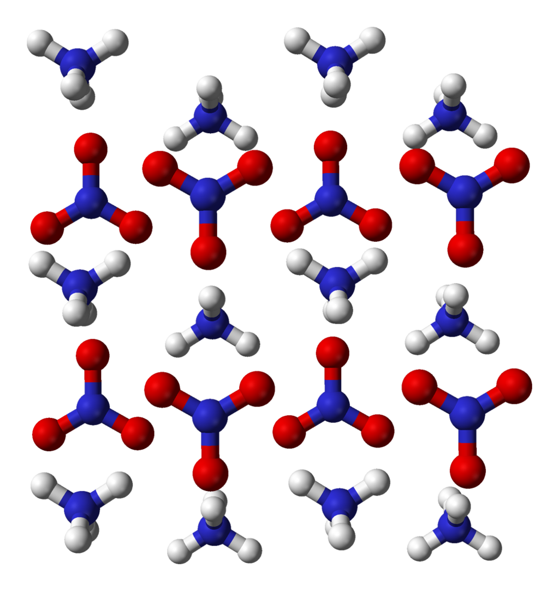
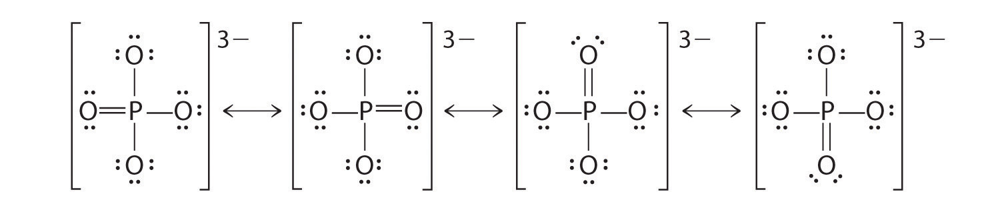

# Glossary

<a id="top"></a>


This glossary is meant to assemble terms that we routinely use in Environmental Sciences and Engineering and which are expected to be mastered by students taking BAE 204 at NC State university. They are ordered in alphabetical list for better retrieval and look up.

## A

### Aerobic respiration

### Anaerobic respiration


<a id="NH3"></a>

### Ammonia
- [Ammonia](https://en.wikipedia.org/wiki/Ammonia) is a colorless gas with a characteristic pungent smell
- Formula: $NH_3$
- Ammonia 3D shape: {width=25%}
- Lewis dot structure: {width=25%}
- Number of electron N has for itself following electronegativity rule: eight
- $NH_3$ can only be an **electron donor**
- Because N has so many electrons to be potentially donated, ammonia is generally unstable in an aerobic environment. As a result, it tends to trace quantities in nature
- When dissolved in water, and depending on the pH of the solution, ammonia converts to [ammonium](#NH4) following the reaction:

$$
H_2O + NH_3 \rightleftharpoons OH^{-} + NH_4^{+}
$$

- Production: 
    - Because of its many uses, ammonia is one of the most highly produced inorganic chemicals. Dozens of chemical plants worldwide produce ammonia. Consuming more than 1% of all man-made power, ammonia production is a significant component of the world energy budget.
    - In 2014, about 88% of the ammonia produced was used for fertilizing agricultural crops
    - Modern ammonia-producing plants generally depend on the [Haber-Bosch process](#haber-bosch) which consists into reducing dinitrogen into ammonia
        
        $$
        3\,H_2 + N_2 \to 2\,NH_3
        $$

- Consumption:
    - Ammonia is directly or indirectly the precursor to most nitrogen-containing compounds. Virtually all synthetic nitrogen compounds are derived from ammonia. 
    - 

<div class = "row">
<div class = "col-md-9"></div>
<div class = "col-md-3" align="right">*[back to top](#top)*</div></div>


<br/><br/><br/>

<a id="NH4"></a>

### Ammonium

- [Ammonium](https://en.wikipedia.org/wiki/Ammonium) is the most reduced inorganic nitrogenous cation (positively charged). 
- Ammonium 3D shape: {width=25%}
- Lewis dot structure: {width=25%}
- Number of electron N has for itself following electronegativity rule: eight
- It is formed by the protonation of [ammonia](#NH3) following the reaction:

\begin{equation}
H_2O + NH_3 \rightleftharpoons OH^{-} + NH_4^{+} (\#eq:NH3)
\end{equation}

- The relative abundance of ammonium vs ammonia depends on the pH of the solution. See figure below


```{r "NH3-NH4", echo=FALSE}
pKa=c(9.28)
forms=c("NH4","NH3")

#if (length(forms)=4){
pH<-seq(0,14,by=0.01)
denominator= 10^(-pH)+ 10^(-pKa[1])
alpha0=10^(-pH)/denominator
alpha1=(10^(-pKa[1]))/denominator


couleur=c("darkgreen","blue","orange","red","black")
Ylim<-c(0,1.2)
Xlim<-c(0,14)
plot(0,0,xlim=Xlim,ylim=Ylim,col="white",main="",xlab="",ylab="",bty="n",xaxt="n",yaxt="n")
abline(h=0,lwd=2,col="grey")
par(new=TRUE)
abline(h=seq(0,1,by=0.1),lty=3,col="grey")
abline(h=1,lty=1,lwd=1,col="grey")
abline(v=seq(0,14,by=1),lty=3,col="grey")
par(new=TRUE)

   ylab="Relative abundance of each form"
   plot(pH,alpha0,xlim=Xlim,ylim=Ylim,lty=1,lwd=2,type="l",xlab="pH",ylab=ylab,yaxt="n",col=couleur[4])
   par(new=TRUE)
   plot(pH,alpha1,xlim=Xlim,ylim=Ylim,lty=1,lwd=2,type="l",xlab="",ylab="",xaxt="n",yaxt="n",col=couleur[5])
   par(new=TRUE)
   axis(2,,at=c(0,0.2,0.4,0.6,0.8,1),labels=c("0","0.2","0.4","0.6","0.8","1"),cex.axis=1)
   par(new=TRUE)
   text(pKa[1]/2,1.1,substitute(paste(NH[y]^{z}),list(y=4,z="+")),adj=0.5,cex=1.2,col=couleur[4])
   par(new=TRUE)
   text((14-pKa[1])/2+pKa[1],1.1,expression(NH[3]),cex=1.2,adj=0.5,col=couleur[5])
   par(new=TRUE)


```

- Because in most natural aqueous environments, pH is below 8, ammonium tends to be the preponderant form.
- Production:
    - In nature, ammonium is a waste product of the mineralization of organic molecules
    - It is added as fertilizer on soils as [ammonium nitrate](https://en.wikipedia.org/wiki/Ammonium_nitrate) 

- Health hazard:
    - Ammonia vapor has a sharp, irritating, pungent odor that acts as a warning of potentially dangerous exposure
    - Exposure to very high concentrations of gaseous ammonia can result in lung damage and death

- Drinking water standard:


<div class = "row">
<div class = "col-md-9"></div>
<div class = "col-md-3" align="right">*[back to top](#top)*</div></div>


<br/><br/><br/>

### Ammonium nitrate

- [Ammonium nitrate](https://en.wikipedia.org/wiki/Ammonium_nitrate) is a chemical compound, the nitrate salt of the ammonium cation
- It is a white crystal solid and is highly soluble in water. 
- Formula: $NH_4NO_3$
- 3D shape: {width=33%}
- It is predominantly used in agriculture as a high-nitrogen fertilizer
- Its other major use is as a component of explosive mixtures used in mining, quarrying, and civil construction

- Production:
    - Ammonium nitrate does exist naturally in mines of the [Atacama desert](https://en.wikipedia.org/wiki/Atacama_Desert) in Chile but globally nearly all ammonium nitrate is now produced synthetically
    - Byproduct of all respiration processes. 
Ammonium ions are a waste product of the metabolism of animals. In fish and aquatic invertebrates, it is excreted directly into the water. In mammals, sharks, and amphibians, it is converted in the urea cycle to urea, because urea is less toxic and can be stored more efficiently. In birds, reptiles, and terrestrial snails, metabolic ammonium is converted into uric acid, which is solid and can therefore be excreted with minimal water loss.

- Consumption/utilization:
    - It is used as a fertilizer, because it tends to release inorganic nitrogen slowly in soil. Applied as a surface fertilizer, it penetrates the soil with rainfall infiltration. Highly soluble, the nitrate anion becomes readily available to plant roots, although it is susceptible to leaching below the root system into the shallow and deep groundwater. The ammonium cation tends to adsorb to soil particles and is thus not as susceptible to leaching. Ammonium can be directly uptaken by plant roots, which thermodynamically makes sense, although because in most soils aerobic conditions are preponderant, nitrate tends to be the ion uptaken most often. Soil bacteria in the aerobic zone of the soil will oxidize adsorbed ammonium into nitrate, which then becomes available for plant roots. The whole chain of events slows the release of inorganic nitrogen to crops and thus makes for more effective fertilizers.
    
- Health hazard
    - No direct known health hazard  

<div class = "row">
<div class = "col-md-9"></div>
<div class = "col-md-3" align="right">*[back to top](#top)*</div></div>

<br/><br/><br/>

### Anoxic waters

- Anoxic waters are areas of sea water, fresh water, or groundwater that are depleted of dissolved oxygen and are a more severe condition of hypoxia (Wikipedia)
- Anoxic waters result from an *__IMBALANCE__* between oxygen supply and demand

<div class = "row">
<div class = "col-md-9"></div>
<div class = "col-md-3" align="right">*[back to top](#top)*</div></div>


<br/><br/><br/>

## C

<a id="CO2"></a>

### Carbon dioxide

- Carbon dioxide is a colorless gas which density is 50% higher than that of dry air.
- Formula: CO~2~
- Carbon dioxide 3D shape: {width=25%}
- Lewis dot structure: 
- Number of electron C has for itself following electronegativity rule: zero
- CO~2~ can only be an electron acceptor

- Production: 
    - oxidation of C in all organic molecules
    - Almost all respiratory processes on earth (some respiration does not involve oxidation of C)
    - Combustion of all Carbon-based fuel

- Consumption:
    - Photosynthesis
        - Atmospheric carbon dioxide **is the primary carbon source for life** on Earth
    - Calcite precipitation in the oceans 

- Ecological Significance:
    - Greenhouse Gas, which serves as reference for all other GHG
    - Concentration in the atmosphere ~380 ppm on the rise, or 0.38%, or a partial pressure of 0.38 atm

<center>


[concentrations of carbon dioxide in the atmosphere from hundreds of thousands of years ago through 2015, measured in parts per million (ppm). The data come from a variety of historical ice core studies and recent air monitoring sites around the world. Each line represents a different data source](https://https://www.epa.gov/sites/production/files/2016-08/documents/print_ghg-concentrations-2016.pdf) [@Epa2016-yj]

</center>

<br/>

  - In reality, concentrations are not stable, and vary widely in time and in space at the next two videos nicely show. 
  
  - The next one results from the model simulations


<br/>

<center>

<iframe "Youtube video of CO~2~ modeled seasonal variations" width="640" height="360" src="https://www.youtube.com/embed/WGHkY0E4FMY" frameborder="0" allow="autoplay; encrypted-media" allowfullscreen></iframe>

[Youtube video of CO~2~ modeled seasonal variations](https://www.youtube.com/embed/WGHkY0E4FMY)

</center>

<br/><br/>
    - The following one is the combination of both models and observations

<br/>

<center>

<iframe width="640" height="360" src="https://www.youtube.com/embed/2BWWrJr6TJw" frameborder="0" allow="autoplay; encrypted-media" allowfullscreen></iframe>

[Youtube video of CO~2~ modeled and observed seasonal variations](https://www.youtube.com/embed/2BWWrJr6TJw)

</center>

<br/><br/>

<div class = "row">
<div class = "col-md-9"></div>
<div class = "col-md-3" align="right">*[back to top](#top)*</div></div>

### Carbonates

- After carbon dioxide dissolves in water, it will combine with water to form carbonic acid ($H_2CO_3$).
- Carbonate serves as __the carbon source__ for aquatic vegetation
- Carbonic acid can then dissociate into bicarbonate ($HCO_3^-$) and carbonate ($CO_3^{2-}$)

>The term "bicarbonate" was coined in 1814 by the English chemist William Hyde Wollaston. The prefix "bi" in "bicarbonate" comes from an outdated naming system and is based on the observation that there is twice as much carbonate (CO~3~^2−^) per sodium ion in sodium bicarbonate (NaHCO~3~) and other bicarbonates than in sodium carbonate (Na~2~CO~3~) and other carbonates. The name lives on as a [trivial name](https://en.wikipedia.org/wiki/Trivial_name). [@Wikipedia_contributors2018-lc].

\begin{align}
H_2CO_3  & \rightleftharpoons & HCO_3^- + H^+  (\#eq:H2CO3) \\
HCO_3^- & \rightleftharpoons & CO_3^{2-} + H^+ (\#eq:HCO3)
\end{align}

- In an environment not open to the atmosphere (or where direct exchange with the atmosphere is very limited like in stream or wetland sediment), the preponderant form depends on the pH and can be calculated as illustrated on the graph below.

``` {r "CO3", echo=FALSE}
pKa=c(6.362,10.33)
forms=c("H2CO3","HCO3","CO3")

#if (length(forms)=4){
pH<-seq(0,14,by=0.01)
denominator= 10^(-2*pH)+ 10^(-pKa[1])*10^(-pH)+10^(-pKa[1])*10^(-pKa[2])
alpha0=10^(-2*pH)/denominator
alpha1=(10^(-pH)*10^(-pKa[1]))/denominator
alpha2=10^(-pKa[1])*10^(-pKa[2])/denominator

couleur=c("blue","orange","red","black","darkgreen")
Ylim<-c(0,1.2)
Xlim<-c(0,14)
plot(0,0,xlim=Xlim,ylim=Ylim,col="white",main="",xlab="",ylab="",bty="n",xaxt="n",yaxt="n")
abline(h=0,lwd=2,col="grey")
par(new=TRUE)
abline(h=seq(0,1,by=0.1),lty=3,col="grey")
abline(h=1,lty=1,lwd=1,col="grey")
abline(v=seq(0,14,by=1),lty=3,col="grey")
par(new=TRUE)

   plot(pH,alpha0,xlim=Xlim,ylim=Ylim,lty=1,lwd=2,type="l",xlab="",ylab="",xaxt="n",yaxt="n",col=couleur[1])
   par(new=TRUE)
   plot(pH,alpha1,xlim=Xlim,ylim=Ylim,lty=1,lwd=2,type="l",xlab="",ylab="",xaxt="n",yaxt="n",col=couleur[2])
   par(new=TRUE)
   plot(pH,alpha2,xlim=Xlim,ylim=Ylim,lty=1,lwd=2,type="l",xlab="pH",ylab="alpha",yaxt="n",col=couleur[3])
   axis(2,,at=c(0,0.2,0.4,0.6,0.8,1),labels=c("0","0.2","0.4","0.6","0.8","1"),cex.axis=1)
   par(new=TRUE)
   text(1,1.1,substitute(paste(H[x],CO[y]),list(x=2,y=3)),cex=1.2,col=couleur[1])
   par(new=TRUE)
   text((pKa[2]-pKa[1])/2+pKa[1],1.1,substitute(paste(HCO[x]^{y}),list(x=3,y="-")),adj=0.5,cex=1.2,col=couleur[2])
   par(new=TRUE)
   text(14,1.1,substitute(paste(CO[x]^{z}),list(x=3,z="2-")),cex=1.2,adj=1,col=couleur[3])
   par(new=TRUE)

```

- Carbon dioxide and carbonates are fully oxidized forms of inorganic molecules with just one atom of C: the carbon atom has **zero electrons** for itself as shown in Figure \@ref(fig:ElecAlloc-CO2-carbonates)

```{r "ElecAlloc-CO2-carbonates", echo=FALSE, out.width = '22%', fig.show = 'hold', fig.align = 'center', fig.cap="Electron allocation on each of the fully oxidized forms of C, including from left to right CO~2~, carbonic acid, hydrogen carbonate (or bicarbonate), and carbonate, showing that the C atoms have no electrons for themselves"}
knitr::include_graphics(c("pictures/ElecAlloc_CO2.png","pictures/ElecAlloc_H2CO3.png","pictures/ElecAlloc_HCO3-.png","pictures/ElecAlloc_CO32-.png"))
```

- In sea water, Carbonate can combine with Ca^2+^ to form Calcium Carbonate (CaCO~3~), which precipitates out of solution. In other words, calcium carbonate formation is a sink for carbonate, and ultimately from CO~2~ addition from the atmosphere to to increased CO~2~ concentrations in the atmosphere. 
- Carbonates are thus a great pH buffer in aquatic environments

<br/><br/><br/>

### Catabolism

- Reactions involving the breaking down of organic substrates, typically by oxidative breakdown, to provide
chemically available energy (e.g. A TP) and/or to generate metabolic intermediates used in subsequent
anabolic reactions [@De_Bolster1997-ul]. 
- Synonyms:
    - Aerobic and anaerobic *respirations* which use organic molecules as electron donors, are synonyms of catabolism.
    - In soil science another synonym of catabolism is *mineralization*, which refers to the decomposition or oxidation of the chemical compounds in organic matter releasing the nutrients contained in those compounds into soluble inorganic forms that may be plant-accessible [@Wikipedia_contributors2018-ew].


## D

### Denitrification

- The *microbially mediated dissimilatory reduction of nitrate into dinitrogen*
- see [denitrification in chapters](#denit) for more details


### Dihydrogen sulfide

- see [hydrogen sulfide](#H2S)

<br/><br/>

<div class = "row">
<div class = "col-md-9"></div>
<div class = "col-md-3" align="right">*[back to top](#top)*</div></div>


## E
### Eutrophication

- Definitions:
    - 'an increase in the rate of supply of organic matter to an ecosystem' [@Nixon1995-th]
    - 'is the enrichment of a water body with nutrients, usually with an excess amount of nutrients' (Wikipedia)
    - 'the enrichment of water by nutrients, especially nitrogen and/or phosphorus, causing an accelerated
growth of algae and higher forms of plant life to produce an undesirable disturbance to the balance of
organisms present in the water and to the quality of water concerned’ [@Anonymous1991-ho]
    - ‘the enrichment of water by nitrogen compounds causing an accelerated growth of algae and higher forms of plant life to produce an undesirable disturbance to the balance of organisms present in the water and to the quality of water concerned’ [@Anonymous1991-xb]
    
<br/><br/>

<div class = "row">
<div class = "col-md-9"></div>
<div class = "col-md-3" align="right">*[back to top](#top)*</div></div>


<br/><br/><br/>

## F

### Fischer projection

- see [Structural formula](#structural-formula)

<br/><br/>

<div class = "row">
<div class = "col-md-9"></div>
<div class = "col-md-3" align="right">*[back to top](#top)*</div></div>


<br/><br/><br/>


## G

<a id="GHG"></a>

### Greenhouse gases *(GHG)*

A greenhouse gas is a gas in an atmosphere that absorbs and emits radiant energy within the thermal infrared range. This process is the fundamental cause of the greenhouse effect. The primary greenhouse gases in Earth's atmosphere are **water vapor**, **[carbon dioxide](#CO2)**, **methane**, **[nitrous oxide](#N2O)**, and **ozone**. Without greenhouse gases, the average temperature of Earth's surface would be about −18 &deg;C (0 &deg;F), rather than the present average of 15 &deg;C (59 &deg;F). In the Solar System, the atmospheres of Venus, Mars and Titan also contain gases that cause a greenhouse effect. ([Wikipedia](https://en.wikipedia.org/wiki/Greenhouse_gas))

<br/><br/>

<div class = "row">
<div class = "col-md-9"></div>
<div class = "col-md-3" align="right">*[back to top](#top)*</div></div>

<br/><br/><br/>

## H

<a "haber-bosch"></a>

### Haber-Bosch process

- [Haber-Bosch process](https://en.wikipedia.org/wiki/Haber_process)

<br/><br/>

<div class = "row">
<div class = "col-md-9"></div>
<div class = "col-md-3" align="right">*[back to top](#top)*</div></div>


<br/><br/><br/>

### Haworth Projection

- see [Structural formula](#structural-formula)

<br/><br/>

<div class = "row">
<div class = "col-md-9"></div>
<div class = "col-md-3" align="right">*[back to top](#top)*</div></div>


<br/><br/><br/>


### Hydrogen Sulfide {#H2S}

- It is a colorless gas with the characteristic foul odor of rotten eggs. 
- It is very poisonous, corrosive, flammable and acidic in nature.
- Formula: $H_2S$
- hydrogen sulfide #D shape: {width=25%}
- Lewis dot structure: {width=25%}
- Number of electron S has for itself following electronegativity rule: eight
- $H_2S$ can only be an electron donor
- Unstable under aerobic conditions, will readily be oxidized into [sulfate](#SO4)
- $H_2S$ is a polyprotic acid which can lose up to 2 protons in water, depending on the pH.


\begin{align}
H_2S & \rightleftharpoons & HS^- + H^+ (\#eq:H2S) \\
HS^- & \rightleftharpoons & S^{2-}+ H^+ (\#eq:HS) 
\end{align}


- The figure below suggests that at pH found in most streams (4.5 to 8), $H_2S$ is either preponderant or corresponds to at least 20% of all sulfide forms. $H_2S$ being a highly volatile product, it explains why we can easily smell and detect it in most conditions in streams.

``` {r "H2S", echo=FALSE}
pKa=c(7.02,12.9)
forms=c("H2S","HS","S")

#if (length(forms)=4){
pH<-seq(0,14,by=0.01)
denominator= 10^(-2*pH)+ 10^(-pKa[1])*10^(-pH)+10^(-pKa[1])*10^(-pKa[2])
alpha0=10^(-2*pH)/denominator
alpha1=(10^(-pH)*10^(-pKa[1]))/denominator
alpha2=10^(-pKa[1])*10^(-pKa[2])/denominator

couleur=c("darkgreen","blue","orange","red","black")
Ylim<-c(0,1.2)
Xlim<-c(0,14)
plot(0,0,xlim=Xlim,ylim=Ylim,col="white",main="",xlab="",ylab="",bty="n",xaxt="n",yaxt="n")
abline(h=0,lwd=2,col="grey")
par(new=TRUE)
abline(h=seq(0,1,by=0.1),lty=3,col="grey")
abline(h=1,lty=1,lwd=1,col="grey")
abline(v=seq(0,14,by=1),lty=3,col="grey")
par(new=TRUE)

   plot(pH,alpha0,xlim=Xlim,ylim=Ylim,lty=1,lwd=2,type="l",xlab="",ylab="",xaxt="n",yaxt="n",col=couleur[1])
   par(new=TRUE)
   plot(pH,alpha1,xlim=Xlim,ylim=Ylim,lty=1,lwd=2,type="l",xlab="",ylab="",xaxt="n",yaxt="n",col=couleur[2])
   par(new=TRUE)
   plot(pH,alpha2,xlim=Xlim,ylim=Ylim,lty=1,lwd=2,type="l",xlab="pH",ylab="alpha",yaxt="n",col=couleur[3])
   axis(2,,at=c(0,0.2,0.4,0.6,0.8,1),labels=c("0","0.2","0.4","0.6","0.8","1"),cex.axis=1)
   par(new=TRUE)
   text(1,1.1,substitute(paste(H[x],S),list(x=2)),cex=1.2,col=couleur[1])
   par(new=TRUE)
   text((pKa[2]-pKa[1])/2+pKa[1],1.1,substitute(paste(HS^{x}),list(x="-")),adj=0.5,cex=1.2,col=couleur[2])
   par(new=TRUE)
   text(14,1.1,substitute(paste(S^{z}),list(z="2-")),cex=1.2,adj=1,col=couleur[3])
   par(new=TRUE)
```

- Production:
    - Hydrogen sulfide often results from the microbial breakdown, or mineralization, of organic matter in anaerobic conditions, such as may exist in swamps and sewers. When happening in sediment, this is referred to as sediment diagenesis

- Consumption:

<br/><br/>

<div class = "row">
<div class = "col-md-9"></div>
<div class = "col-md-3" align="right">*[back to top](#top)*</div></div>

## L

### Lithotrophs

- Lithotrophs are a diverse group of organisms using inorganic substrate (usually of mineral origin) to obtain reducing equivalents for use in biosynthesis (e.g., carbon dioxide fixation) or energy conservation (i.e., ATP production) via aerobic or anaerobic respiration. Known chemolithotrophs are exclusively microorganisms. [@Wikipedia_contributors2018-na]

<br/><br/>

<div class = "row">
<div class = "col-md-9"></div>
<div class = "col-md-3" align="right">*[back to top](#top)*</div></div>


<br/><br/><br/>

### Limiting factor


<br/><br/>

<div class = "row">
<div class = "col-md-9"></div>
<div class = "col-md-3" align="right">*[back to top](#top)*</div></div>


<br/><br/><br/>

## M
### Methane

- Under [normal conditions for temperature and pressure](https://en.wikipedia.org/wiki/Standard_conditions_for_temperature_and_pressure), methane is a colorless, odorless gas main constituent of natural gas, and the simplest alkane
- Formula: $CH_4$
- Methane 3D shape: {width=25%}
- Lewis dot structure of methane: 
- Number of electron C has for itself following electronegativity rule: eight
- $CH_4$ can only be an electron **donor**
- Because methane has so many electrons to give, it will easily 'burn' in normal atmosphere (provided that ignition T&deg;C be reached, e.g., by a spark), liberating large quantities of heat (55.5 MJ/kg). The electrons are transferred from the carbon to the oxygen atoms following two redox half-reactions to obtain the overall reaction:


\begin{align}
CH_4 + 2\,H_2O & \rightleftharpoons & CO_2 + 8\,H^+ + 8\,e^-\\
2\,O_2 + 8\,H^+ + 8\,e^- & \rightleftharpoons & 4\,H_2O\\
& &\\
\hline\\
CH_4 + 2\,O_2 & \to & CO_2 + 2\,H_2O
\end{align}


- Production:

- Consumption:

- Ecological significance:

<center>


[Concentrations of methane in the atmosphere from hundreds of thousands of years ago through 2015, measured in parts per billion (ppb). The data come from a variety of historical ice core studies and recent air monitoring sites around the world. Each line represents a different data source](https://www.epa.gov/sites/production/files/2016-08/documents/print_ghg-concentrations-2016.pdf)[@Epa2016-yj]

</center>

- Health effects:

<br/><br/><br/>

### Mineralization

- see [catabolism](#catabolism)

<br/><br/><br/>

## N

<a id="NO3"></a>

### Nitrate

- Nitrate is the stable inorganic nitrogenous anion in oxidized water
- Formula: $NO_3^{-}$
- Nitrate 3D shape: {width=25%}
- Lewis dot structure of nitrate: 
- Number of electron N has for itself following electronegativity rule: zero
- $NO_3^{-}$ can only be an electron acceptor
- $NO_3^{-}$ is technically the conjugate base of nitric acid $HNO_3$, but the $pk_A$ of the reaction is at a theoretical pH of -1.38. In other words, for the pH of most natural waters (4.5 < pH < 8), $HNO_3$ is totally insignificant.

- Production:
    - from the complete [oxidation](#oxidation) of inorganic nitrogenous molecules which include [ammonia](#NH3), [ammonium](#NH4), [nitrite](#NO2)
    - from the mineralization and complete oxidation of [amine radicals](#amine) in organic molecules

- Consumption:
    - **Uptake** from microbes, plants, and algae for their [anabolism](#anabolism), which consists in building complex organic molecules from inorganic ones. 
        - Uptake, assimilation, anabolism, immobilization are all synonymous terms to express the fact that the N atom is immobilized, at least temporarily in organic molecules. 
        - Because N is assimilated in organic molecules during uptake/anabolism, and because N gains electrons in the process (it is thus ***reduced***), we refer to nitrate uptake as **[assimilatory nitrate reduction](#ANR)**.
    - **[Denitrification](#denitrification)**: under anaerobic conditions, nitrate is used by facultative anaerobes as electron acceptor to generate [ATP](#ATP) in their respiration chain. The two major end products of denitrification are gases, namely [dinitrogen ($N_2$)](#N2) and [nitrous oxide ($N_2O$)](#N2O), which leave the aqueous environment. As such, nitrate is not assimilated by any bacteria and denitrification is therefore, as opposed to uptake, referred to as **[dissimilatory nitrate reduction](#DNR) into [dinitrogen ($N_2$)](#N2) and [nitrous oxide ($N_2O$)](#N2O).

- Ecological significance:
    - Because of assimilation and denitrification processes, the overall nitrate concentrations in rivers tends to diminish from the catchment headwaters to the receiving bodies such as estuaries and coastal areas. As a result, inorganic nitrogen has naturally been in very short supply in these coastal water bodies, and nitrate and traditionally been the nutrient limiting aquatic productivity there. Very much like with phosphate, algae have adapted to be able to grow in very low concentrations. Anthropogenic activities, and agriculture in particular, have largely increased the loads and concentration of nitrate reaching estuaries, to the point where nitrate is no longer the limiting factor. As a result, excess nitrate is one of the reasons for the global and persistent presence of algal blooms in estuaries and coastal waters. 
    
- Health hazard:
    - There is a heated debate about the health hazard that nitrate might pose. Some argue that if anything, there might be beneficial effects, while others argue that there are evidence of cancers linked to excess nitrate absorption. Unfortunately, arguments on both sides might not be totally independent of militantism and lobbies.
    - The only consensus everybody seems to agree upon is the Blue Baby syndrome, or methemoglobinemia. Methemoglobinemia is an unusual and potentially fatal condition in which hemoglobin is oxidized to methemoglobin and loses its ability to bind and transport oxygen, hence the cyanosis (blue appearance) usually visible on fingers, toes, and lips. Nitrate reduced to nitrite in the body of humans and animals enters the body stream where it seems to directly oxidize oxyhemoglobin to methemoglobin-peroxide complex.

<br/>

<center>

[{width=50%}](https://syndromespedia.com/blue-baby-syndrome.html)

[**Picture of a Blue Baby from syndromespedia.com/blue-baby-syndrome.html**](https://syndromespedia.com/blue-baby-syndrome.html)

</center>

<br/>

- Drinking water standards
    - Although there is still a heated debate whether or not nitrate does have have detrimental health effects, the World Health Organization has provided maximum concentration guidelines of 50 mg/L as nitrate [@World_Health_Organization2011-hd]. These guidelines have been enacted in hard laws in the US and in Europe. The 50 mg/L as nitrate equates 11.2 mg $NO_3$-N/L and in the US, the drinking water standard is **10 mg $NO_3$-N/L**.
    
    
<br/><br/>

<div class = "row">
<div class = "col-md-9"></div>
<div class = "col-md-3" align="right">*[back to top](#top)*</div></div>
<br/><br/><br/>

<a id="N2O"></a>

### Nitrous Oxide

- Commonly known as laughing gas
- Nitrous oxide has significant medical uses, especially in surgery and dentistry, for its anesthetic and pain reducing effects.
- Formula: $N_2O$
- Nitrous Oxide 3D shape: {width=25%}
- {width=25%}
- Number of electron N has for itself following electronegativity rule: 
    - the first one on the left has 5
    - the middle N has 3
- $N_2O$ can be both an electron acceptor and an electron donor

- Production:
    - $N_2O$ is produced due to bacterial processes (over 90%) and anthropogenic processes such as burning of fossil fuel
        - The two main bacterial processes are *nitrification* and *denitrification*
        - Accounting that human activities have enhanced both nitrification and denitrification processes, it is estimated that overall, about 2/3rd of $N_2O$ production is natural, and about 1/3rd is human enhanced

- Consumption:
    - Because of all the electrons stored on the two N atoms (5 + 3 = 8), nitrous oxide is a potential electron donor and bacteria can use it for their respiration processes

- Ecological significance:
  - Powerful Greenhouse Gas, 298 times that of CO~2~ ([EPA](https://www.epa.gov/sites/production/files/2015-07/documents/emission-factors_2014.pdf))
  - Concentration in the atmosphere ~0.0003 ppm or ~325 ppb on the rise

<br/>

<center>


[Concentrations of nitrous oxide in the atmosphere from hundreds of thousands of years ago through 2015, measured in parts per billion (ppb). The data come from a variety of historical ice core studies and recent air monitoring sites around the world. Each line represents a different data source](https://www.epa.gov/sites/production/files/2016-08/documents/print_ghg-concentrations-2016.pdf))[@Epa2016-yj]

</center>

<br/><br/>

<div class = "row">
<div class = "col-md-9"></div>
<div class = "col-md-3" align="right">*[back to top](#top)*</div></div>

<br/><br/><br/>

## O
### Oligotrophication

- 'a decrease in the rate of supply of organic matter to an ecosystem' [@Nixon2009-ft]

<br/><br/>

<div class = "row">
<div class = "col-md-9"></div>
<div class = "col-md-3" align="right">*[back to top](#top)*</div></div>

<br/><br/><br/>

### Oxidation

- Oxidation is the *__loss of electrons__* by a molecule, atom, or ion.
- The term oxidation was first used by Antoine Lavoisier to signify reaction of a substance with oxygen. Much later, it was realized that the substance, upon being oxidized, loses electrons, and the meaning was extended to include other reactions in which electrons are lost.

<br/><br/>

<div class = "row">
<div class = "col-md-9"></div>
<div class = "col-md-3" align="right">*[back to top](#top)*</div></div>

<br/><br/><br/>

### Oxidation state

- The oxidation state (*OS*), or sometimes referred to as the oxidation number, quantifies the number of electrons that an atom has gained (expressed as *__negative__* charge value) or lost (expressed as *__positive__* charge value) compared to the number of valence electrons it has in its free form. As a result, it can be zero, positive or negative. 
- For metal ions, the OS corresponds to its charge
- The *change* in oxidation state is a very powerful tool to understand the [redox](#redox) processes involved in the environement. But OS is less than ideal when comparing the absolute number of electrons one element *has for itself*
- For example, the nitrogen atom N, has 5 valence electrons. In the dinitrogen molecule N~2~, the Lewis dot structure suggests that each atom share 3 electrons with the other but essentially have 5 electrons for themselves as in Figure \@ref(fig:ElecAlloc-N2)

```{r "ElecAlloc-N2", echo=FALSE, out.width = '20%', fig.align = 'center', fig.cap="Electron allocation on each of the N atom for the dinitrogen molecule N~2~"}
knitr::include_graphics("pictures/ElecAlloc_N2.png")
```

As a result, the number of electron on each atom equals the number of valence electrons on the free form of N, hence OS = 0. Now in the nitrous oxide case in Figure \@ref(fig:ElecAlloc-N2O), the nitrogen atom to the left OS = 0, but for the middle Nitrogen atom, OS = -2, as two electrons were stripped by oxygen.

```{r "ElecAlloc-N2O", echo=FALSE, out.width = '20%', fig.align = 'center', fig.cap="Electron allocation on each of the N atom for the N~2~O molecule"}
knitr::include_graphics("pictures/ElecAlloc_N2O.png")
```

The problem with the oxidation state indicator is that it is a relative number, and not absolute. The electron allocation indicator that quantifies the number of electrons each atom has for itself is more abolute and thus comparable. For example, the inorganic molecule with one C atom stable in an oxidized environment is CO~2~, the inorganic molecule with one N atom stable in an oxidized environment is $NO_3^-$, and the inorganic molecule with one S atom stable in an oxidized environment is $SO_4^{2-}$. All three atoms have zero electrons for themselves as oxygen has 'stolen' them (Figure \@ref(fig:ElecAlloc-CO2-NO3-SO4)). So they are all potential electron acceptors that can accept up to 8 electrons. In a way they are very similar.

```{r "ElecAlloc-CO2-NO3-SO4", echo=FALSE, out.width = '20%', fig.show = 'hold', fig.align = 'center', fig.cap="Electron allocation on each of the C, N, and S atom for the CO~2~, nitrate and sulfate molecules"}
knitr::include_graphics(c("pictures/ElecAlloc_CO2.png","pictures/ElecAlloc_NO3-.png","pictures/ElecAlloc_SO42-.png"))
```

But if one calculates the oxidation states for each of the C, N, and S atoms, for these three molecules, one would find OS~C~ = -4, OS~N~ = -5, and OS~S~ = -6... We believe this can be very confusing and prefer to use the electron allocation concept as a more absolute indicator.

<br/><br/>

<div class = "row">
<div class = "col-md-9"></div>
<div class = "col-md-3" align="right">*[back to top](#top)*</div></div>

<br/><br/><br/>


## P
### Phosphate

- [Phosphate](https://en.wikipedia.org/wiki/Phosphate) is an inorganic chemical and a salt-forming anion of phosphoric acid
- Formula: $PO_4^{3-}$
- 
- Phosphate is one of the anions of the polyprotic acid (i.e., which can liberate several protons $H^{+}$)
- The conjugate bases of phosphate are:

{width=100%}

- All conjugate bases are related through the set acid-base chemical equilibria:

\begin{align}
H_3PO_4  & \rightleftharpoons & H_2PO_4^- + H^+ \tag{$pK_A$ = 2.12}\\
H_2PO_4^- & \rightleftharpoons & HPO_4^{2-} + H^+ \tag{$pK_A$ = 7.21}\\
HPO_4^{2-}& \rightleftharpoons & PO_4^{3-} + H^+ \tag{$pK_A$ = 12.67}
\end{align}


- The preponderant form of phosphate in a solution also depends on the pH following this relationship:

```{r "phosphates", echo=FALSE}

pKa=c(2.12,7.21,12.67)
forms=c("H3PO4","H2PO4","HPO4","PO4")

#if (length(forms)=4){
pH<-seq(0,14,by=0.01)
denominator= 10^(-3*pH)+ 10^(-pKa[1])*10^(-2*pH)+10^(-pKa[1])*10^(-pKa[2])*10^(-pH)+ 10^(-pKa[1])*10^(-pKa[2])*10^(-pKa[3])
alpha0=10^(-3*pH)/denominator
alpha1=(10^(-2*pH)*10^(-pKa[1]))/denominator
alpha2=(10^(-pH)*10^(-pKa[1])*10^(-pKa[2]))/denominator
alpha3=10^(-pKa[1])*10^(-pKa[2])*10^(-pKa[3])/denominator

couleur=c("darkgreen","blue","orange","red","black")
Ylim<-c(0,1.2)
Xlim<-c(0,14)
plot(0,0,xlim=Xlim,ylim=Ylim,col="white",main="",xlab="",ylab="",bty="n",xaxt="n",yaxt="n")
abline(h=0,lwd=2,col="grey")
par(new=TRUE)
abline(h=seq(0,1,by=0.1),lty=3,col="grey")
abline(h=1,lty=1,lwd=1,col="grey")
abline(v=seq(0,14,by=1),lty=3,col="grey")
par(new=TRUE)

   ylab="Relative abundance of each form"
   plot(pH,alpha0,xlim=Xlim,ylim=Ylim,lty=1,lwd=2,type="l",xlab="pH",ylab=ylab,yaxt="n",col=couleur[1])
   par(new=TRUE)
   plot(pH,alpha1,xlim=Xlim,ylim=Ylim,lty=1,lwd=2,type="l",xlab="",ylab="",xaxt="n",yaxt="n",col=couleur[2])
   par(new=TRUE)
   plot(pH,alpha2,xlim=Xlim,ylim=Ylim,lty=1,lwd=2,type="l",xlab="",ylab="",xaxt="n",yaxt="n",col=couleur[3])
   par(new=TRUE)
   plot(pH,alpha3,xlim=Xlim,ylim=Ylim,lty=1,lwd=2,type="l",xlab="",ylab="",xaxt="n",yaxt="n",col=couleur[4])
   axis(2,,at=c(0,0.2,0.4,0.6,0.8,1),labels=c("0","0.2","0.4","0.6","0.8","1"),cex.axis=1)
   par(new=TRUE)
   text(1,1.1,expression(paste(H[3],PO[4])),cex=1.2,col=couleur[1])
   par(new=TRUE)
   text((pKa[2]-pKa[1])/2+pKa[1],1.1,substitute(paste(H[x],PO[y]^{z}),list(x=2,y=4,z="-")),adj=0.5,cex=1.2,col=couleur[2])
   par(new=TRUE)
   text((pKa[3]-pKa[2])/2+pKa[2],1.1,substitute(paste(HPO[y]^{z}),list(y=4,z="2-")),cex=1.2,adj=0.5,col=couleur[3])
   par(new=TRUE)
   text(14,1.1,substitute(paste(PO[y]^{z}),list(y=4,z="3-")),adj=1,cex=1.2,col=couleur[4])
   par(new=TRUE)

```

- The phosphoric acid and phosphates are fully oxidized forms of inorganic molecules with just one atom of P: the Phosphorus atom has **zero electrons** for itself as shown in Figure \@ref(fig:ElecAlloc-H3PO3-to-phosphate) below:

```{r "ElecAlloc-H3PO3-to-phosphate", echo=FALSE, out.width = '22%', fig.show = 'hold', fig.align = 'center', fig.cap="Electron allocation on each of the fully oxidized forms of P, including from left to right Phosphoric acid, dihydrogen Phosphate, hydrogen phosphate, and phosphate , showing that the P atoms have no electrons for themselves"}
knitr::include_graphics(c("pictures/ElecAlloc_H3PO4.png","pictures/ElecAlloc_H2PO4-.png","pictures/ElecAlloc_HPO42-.png","pictures/ElecAlloc_PO43-.png"))
```


- Production:
    - Phosphorus in general and phosphate in practice has remained one of the nutrients limiting the most plant productivity on our planet
    - Phosphates are the naturally occurring form of the element phosphorus, found in many phosphate minerals
    - Phosphate minerals are mined to obtain phosphorus for use in agriculture and industry
    - The largest global producer and exporter of phosphates is Morocco. 
    - Within North America, the largest deposits lie in the Bone Valley region of central Florida, the Soda Springs region of southeastern Idaho, and the coast of North Carolina (near Aurora).  

- Consumption:
    - Uptake from all primary producer including plants and algae
    - Phosphate can also be immobilized by bacteria
    - In food industry, phosphates help baked goods rise, they act as emulsifiers in processed cheese and canned soup, they add flavor to cola and color to frozen french fries. They also can be added to meat, poultry and seafood to help the protein bind more water, making it juicier after freezing and reheating.  

- Ecological significance:
    - Phosphorus as phosphate naturally is the most limiting factor for primary productivity for land and aquatic plants. Because it tends to bind to particles, phosphates have accumulated with sediment particularly in coastal areas, where phosphate can become available again to algae through [sediment diagenetic processes](#sediment_diagenesis). As a result, phosphate is generally not considered the most limiting factor for algae in estuaries and coastal environment. However, it does tend to be the limiting nutrient in freshwater receiving bodies such as lakes and reservoirs.
    - Excess phosphate in freshwater receiving bodies has been shown to be the nutrient causing some major [eutrophication](#eutrophication) problems throughout the planet

<br/><br/>

<div class = "row">
<div class = "col-md-9"></div>
<div class = "col-md-3" align="right">*[back to top](#top)*</div></div>

<br/><br/><br/>

## R

### Reactive nitrogen

- 

<br/><br/>

<div class = "row">
<div class = "col-md-9"></div>
<div class = "col-md-3" align="right">*[back to top](#top)*</div></div>

<br/><br/><br/>

### Redox

- Redox (short for reduction–oxidation reaction) is a chemical reaction in which the oxidation states of atoms are changed. Any such reaction involves both a [reduction](#reduction) process and a complementary [oxidation](#oxidation) process, effectively allowing the electron transfer processes.

### Redox couple

- redox couples, commonly noted as 'Ox/Red' refer to the two forms that an element might take depending on its [oxidation state](#oxidation-state)
- Ox in 'Ox/Red' refers to as the *oxidizer* or oxidizing agent, as it has the capability to make other elements **lose** their electrons.
- Red in 'Ox/Red' refers to as the *reducer* or reducing agent, as it has the capability to **give** electrons to other elements
- Common redox couples which matter in environmental and ecological engineering include:
    - CO~2~/CH~2~O
    - O~2~/H~2~O
    - NO~3~^-^/N~2~
    - NO~3~^-^/NH~4~^+^
    - NO~3~^-^/NO~2~^-^
    - MnO~2~/Mn^2+^
    - Fe^3+^/Fe^2+^
    - SO~4~^2-^/H~2~S
    - CO~2~/CH~4~

### Redox half-reactions

- A half reaction is either the oxidation or reduction reaction component of a redox reaction. A half reaction is obtained by considering the change in oxidation states of individual substances involved in the redox reaction [@Wikipedia_contributors2018-be]
- Redox half reactions illustrate the transfer of electrons from the oxidized form of an element to a reduced form of an element.
- Half-reactions are often used as a method of balancing redox reactions
- To derive half-reactions, 
    - the first convention is that the oxidizer is on the left of the equation, and the reducer on the right
    - one must first equilibrate all elements other than O and H
    - then one balances for O, by adding H~2~O on the appropriate side of the half reaction
    - then one adds the appropriate number of H^+^ to balance the H
    - Finally one adds the appropriate number of e^-^ to balance the charge. The number of e^-^ must correspond to the change in [oxidation state](#oxidation-state)
- The half-reactions corresponding to the redox couples above are:
- CO~2~/CH~2~O

\begin{equation}
CO_2 + 4 H^+ + 4 e^- \rightleftharpoons CH_2O + H_2O  
\end{equation}

- CH~2~O here is a generic formula to represent the electron donating capacity of OM. This equation might be misleading as it corresponds to the OM donating 4 electrons in the respiration schemes, but because it is written using the ox/red convention, is the opposite of the intuitive direction. So a more intuitive half-reaction might be, and is effectively what is used to write the full redox reaction:

\begin{equation}
CH_2O + H_2O \rightleftharpoons CO_2 + 4 H^+ + 4 e^-
\end{equation}

- O~2~/H~2~O
    
\begin{equation}
O_2 + 4 H^+ + 4 e^- \rightleftharpoons 4H_2O  
\end{equation}
    
    - NO~3~^-^/N~2~
    
\begin{equation}
2 NO_3^- + 10 e^- + 12 H^+ \rightleftharpoons N_2 + 6 H_2O
\end{equation}

    - MnO~2~/Mn^2+^

\begin{equation}
MnO_2 + 4 e^- + 4 H^+ \rightleftharpoons Mn^{2+} + 2 H_2O
\end{equation}  
    
    - Fe^3+^/Fe^2+^
    
\begin{equation}
Fe^{3+} + 1 e^- \rightleftharpoons Fe^{2+} \\
\end{equation}

    - SO~4~^2-^/H~2~S
    
\begin{equation}
SO_4^{2-} + 8 e^- + 10 H^+  \rightleftharpoons H_2S + 4 H_2O
\end{equation}

    - CO~2~/CH~4~

\begin{equation}
CO_2 + 8 e^- + 8 H^+ \rightleftharpoons CH_4 + 2 H_2O
\end{equation}

- a redox reaction __always__ involves two half reactions where the electrons are transfered from the lowest redox potential couple to the highest redox potential couple. For example, the combustion of methane in oxygen involves the two O~2~/H~2~O and CO~2~/CH~4~ couples. The half-reaction of the highest redox potential couple goes on top, and that of the lowest potential at the bottom, but this time written as red/ox like in the equation below:

\begin{align}
2\,O_2 + 8\,H^+ + 8\,e^- & \rightleftharpoons & 4\,H_2O\\
CH_4 + 2\,H_2O & \rightleftharpoons & CO_2 + 8\,H^+ + 8\,e^-\\
& &\\
\hline\\
CH_4 + 2\,O_2 & \to & CO_2 + 2\,H_2O
\end{align}

The electrons cancel out, and in this case the protons as well. So the combustion of methane, which is very simple at first glance, really involves a transfer of electrons, which the half-reactions reveal.

### Reduction

- Reduction is the *__gain__* of electrons by a molecule, atom, or ion.

<br/><br/>

<div class = "row">
<div class = "col-md-9"></div>
<div class = "col-md-3" align="right">*[back to top](#top)*</div></div>

<br/><br/><br/>


## S

### Skeletal formula

> The skeletal formula, also called line-angle formula or shorthand formula, of an organic compound is a type of molecular structural formula that serves as a shorthand representation of a molecule's bonding and some details of its molecular geometry [@Wikipedia_contributors2018-sa].

- see [Structural formula](#structural-formula)

### Structural formula

### Sulfate

- Sulfate is the inorganic sulfur anion stable in oxidized water
- Formula: $SO_4^{2-}$
- Sulfate 3D shape: {width=25%}
- Lewis dot structure of nitrate: 
- Number of electron S has for itself following electronegativity rule: zero
- $SO_4^{2-}$ can only be an *__electron acceptor__*
- $SO_4^{2-}$ is the conjugate base of Hydrogen sulfate $HSO_4^{-}$. The figure below shows that for pH normally measured in surface water and streams (4.5-8), $SO_4^{2-}$ is the truly preponderant form. We therefore generally omit to mention $HSO_4^{-}$ as a chemical form that plays any significant role.

```{r "SO4", echo=FALSE}
pKa=c(1.98)
forms=c("HSO4","SO4")

#if (length(forms)=4){
pH<-seq(0,14,by=0.01)
denominator= 10^(-pH)+ 10^(-pKa[1])
alpha0=10^(-pH)/denominator
alpha1=(10^(-pKa[1]))/denominator


couleur=c("darkgreen","blue","orange","red","black")
Ylim<-c(0,1.2)
Xlim<-c(0,14)
plot(0,0,xlim=Xlim,ylim=Ylim,col="white",main="",xlab="",ylab="",bty="n",xaxt="n",yaxt="n")
abline(h=0,lwd=2,col="grey")
par(new=TRUE)
abline(h=seq(0,1,by=0.1),lty=3,col="grey")
abline(h=1,lty=1,lwd=1,col="grey")
abline(v=seq(0,14,by=1),lty=3,col="grey")
par(new=TRUE)

   plot(pH,alpha0,xlim=Xlim,ylim=Ylim,lty=1,lwd=2,type="l",xlab="pH",ylab="alpha",yaxt="n",col=couleur[1])
   par(new=TRUE)
   plot(pH,alpha1,xlim=Xlim,ylim=Ylim,lty=1,lwd=2,type="l",xlab="",ylab="",xaxt="n",yaxt="n",col=couleur[2])
   par(new=TRUE)
   axis(2,,at=c(0,0.2,0.4,0.6,0.8,1),labels=c("0","0.2","0.4","0.6","0.8","1"),cex.axis=1)
   par(new=TRUE)
   text(1,1.1,substitute(paste(HSO[y]^{z}),list(y=4,z="-")),adj=0.5,cex=1.2,col=couleur[1])
   par(new=TRUE)
   text((14-pKa[1])/2+pKa[1],1.1,substitute(paste(SO[y]^{z}),list(y=4,z="2-")),cex=1.2,adj=0.5,col=couleur[2])
   par(new=TRUE)

```

- During their anabolism, primary producers uptake sulfate, but the sulfur atoms can be incorporated into amino-acids only after sulfur has been reduced, or gained 8 electrons to be in a thiol ($-SH$) form.


- Production:

- Consumption:

- Ecological significance:

- Health effects:

<br/><br/>

<div class = "row">
<div class = "col-md-9"></div>
<div class = "col-md-3" align="right">*[back to top](#top)*</div></div>

<br/><br/><br/><br/><br/>

## T

### Trophic names

- Depending on the source of <font color="blue">carbon</font>, the source of <font color="green">electrons</font>, and the source of <font color="red">energy</font>, organisms have been qualified and called differently. 

***

- Depending on the source of <font color="blue">*__carbon__*</font>

<style>
  .col2 {
    columns: 2 200px;         /* number of columns and width in pixels*/
    -webkit-columns: 2 200px; /* chrome, safari */
    -moz-columns: 2 200px;    /* firefox */
  }
</style>
 

<div class="col2">
**Autotrophs**

- __Auto__*trophs* obtain their carbon needs, on their own, hence *Auto*. 
- In other words, they obtain their carbon from CO~2~ and carbonates
- Just about all green plants and algae are autotrophs

<br>

**Heterotrophs**

- __Hetero__*trophs* obtain their carbon needs, from *others*, hence *Hetero*. 
- In other words, they obtain their carbon from organic matter, some of which might also serve as a source of electrons
- All animals are heterotrophs, and most bacteria are too.
</div>

***

- Depending on the source of <font color="green">*__electrons__*</font>

<div class="col2">
**Lithotrophs**

- __Litho__*trophs* obtain their reducing power or their high energy electrons from inorganic molecules, or *mineral matter*. Literally, *rock eaters*. 
- In other words, they obtain their electrons from molecules or atoms like NH~4~^+^ or Fe^2+^.
- ALL Lithotrophs are unicellular microorganisms
- In the examples above, nitrifiers and iron oxidizing bacteria are lithotrophs

<br>


**Organotrophs**

- __Organo__*trophs* obtain their reducing power or their high energy electrons from *organic* molecules, hence the *organo*  
- In other words, they obtain their electrons from organic matter
- All pluricellular organisms are organotrophs
<br>
<br>
<br>
<br>
<br>

</div>

***

- Depending on the source of <font color="red">*__energy__*</font>

<div class="col2">
**Phototrophs**

- __Photo__*trophs* obtain their energy primarily through sunlight. 
- In reality, at night, phototrophs become chemotrophs as their cellular respiration is based upon oxidizing organic matter. But they are autosufficient. They capture solar energy and store it in a chemical form thanks to photosynthesis, and used that stored energy later on.
- Just about all green plants are phototrophs. 

<br>


**Chemotrophs**

- __Chemo__*trophs* obtain their energy as energy previously stored in a chemical form. 
- Just about all pluricellular organisms are chemotrophs, even the phototrophs, which turn into chemotrophs at night
<br>
<br>
<br>
<br>
<br>
<br>
<br>

</div>
